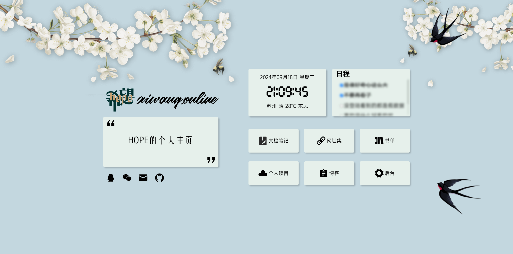

这个项目算是我做的第一个比较完整的全栈项目，从2022年3月8日部署上线，至今已经915天。
现在再看当初的代码，疏漏颇多，实在太烂，所以一直也羞于公开代码。
现在下线不用了，整理了一下代码，放到github上，也算是个留念。
网站的代码都是我亲手写的，但UI却多有借鉴，如果有朋友喜欢，那更建议看看原作，我的模仿还太过拙劣：[链接](https://github.com/imsyy/home)

以下是一些网站的截图：
- 网站运行一周年留念

- 网站运行五百天留念

- 网站下线留念

